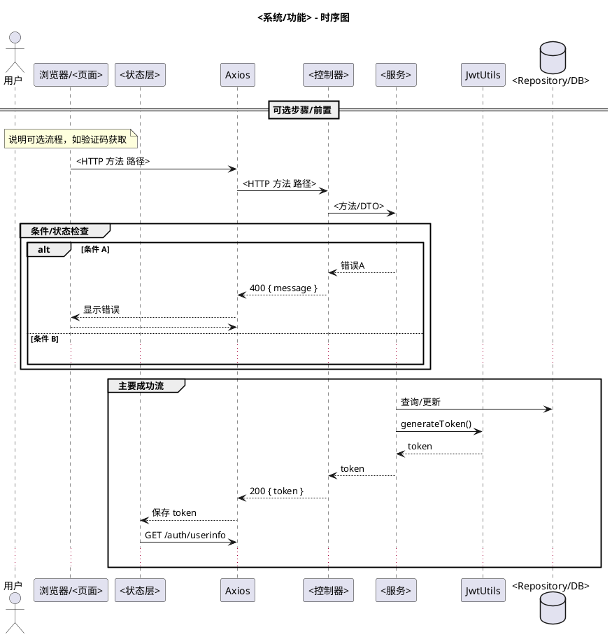

# UML 时序图绘制与归档标准（企业文件管理系统）

## 目的与范围
- 统一登录等核心流程的时序图表达方式，确保可读、可追溯、可维护。
- 适用于本项目所有时序图（登录、注册、文件上传/下载、分享、后台管理等）。

## 工具与格式
- 绘图工具：PlantUML（推荐），文件后缀 `.puml`。
- 编码：UTF-8，图内文本使用中文为主，保留必要的英文关键字（HTTP 方法、路径、类名等）。
- 参与者：优先使用 `actor`、`participant`、`database` 等，避免 activation bar 以降低视觉噪声。

## UML 语义与约定（UML 2.5.x 参考）
- 生命线：区分用户、前端页面/状态、HTTP 客户端、控制器、服务、鉴权组件、仓储/数据库。
- 消息：同步调用使用 `->`；返回消息使用 `-->` 表示（必要时标注返回码/载荷）。
- 组合片段：
  - `alt/else` 表达条件分支（例如：用户不存在、被锁定、验证码错误、密码错误等）。
  - `opt` 或 `group` 表达可选/逻辑分组（例如：验证码显示/刷新）。
- 注释：使用 `title`、`note over <lifeline>` 说明关键设计点与配置来源。
- 命名：消息名尽量对齐代码中实际方法或接口路径，便于追溯实现。

## REST 表达规范（RFC 9110 参考）
- 在消息上标注 `HTTP 方法 + 路径`（例如：`POST /api/auth/login`）。
- 返回消息上可标注 `状态码` 与关键字段（例如：`200 { token }`、`400 { message }`）。
- 对载荷结构给出简要注释（例如：`{ username, password, captcha?, captchaKey? }`）。

## 安全表达规范（JWT/OAuth 与 OWASP ASVS 思路）
- JWT 生命周期：
  - 服务端 `JwtUtils.generateToken(UserDetails)` 生成；
  - 客户端通过 `Authorization: Bearer <token>` 发送；
  - `JwtUtils.validate/extract` 在后端校验与解析。
- 鉴权链：
  - `SecurityConfig` 对 `/api/auth/**` 开放；其它路径需要 JWT；
  - `JwtAuthenticationFilter` 在需要鉴权的请求中验证令牌。
- 登录风控：
  - 连续失败 ≥3 次强制需要验证码；
  - 失败计数与锁定（示例：≥5 次锁定账户）；
  - 错误信息最小化（“用户名或密码错误”）。
- 客户端处理：401 统一清理 token 并重定向登录页；登录成功后再获取 `/auth/userinfo`。

## 分层建模规范
- 调用链顺序建议：
  1) UI（例如：Login.vue）
  2) 状态层（Pinia AuthStore）
  3) HTTP 客户端（Axios/request.js 拦截器）
  4) 控制器（AuthController）
  5) 领域服务（UserService）
  6) 安全组件（AuthenticationManager/JwtUtils/CaptchaService）
  7) 仓储/数据库（UserRepository / users 表）
- 避免跨层直连（例如 UI 直接越过 Store/HTTP 客户端调用后端）。

## 命名与本地化
- 参与者/注释用中文，类名/路径/HTTP 关键字保留英文；统一术语（示例：登录/验证码/锁定）。
- 消息名贴近实现（示例：`/api/auth/login`、`getUserInfo`、`validateCaptcha`）。

## 文件组织与命名
- 归档位置：`docs/系统设计/时序图/`（集中存放时序图）。
- 文件命名：中文 + 主题 + 类型 + 时间戳（`YYYYMMDD-HHMMSS`）。
  - 示例：`登录功能-UML时序图-20251112-132636.puml`。
- 不得随意存放于 `docs` 根目录或与无关文档混放。
- 如需导出图片，建议同名 PNG/SVG 存于同级目录。

## 质量检查清单（提交前自查）
- 参与者与代码实现一一对应（类/文件或模块名可追溯）。
- 所有主要错误分支已覆盖（用户不存在/禁用/锁定、验证码错误、密码错误）。
- 鉴权链路与配置匹配（`SecurityConfig`、`JwtAuthenticationFilter`、`application.yml`）。
- 数据库关键字段体现（`enabled`/`locked`/`login_attempts`/`last_login_time`/`role`）。
- 登录后获取用户信息流程包含并与前端存储一致（`localStorage`、`Authorization`）。

## 示例与参考
- 现有示例：`docs/系统设计/时序图/登录功能-UML时序图-20251112-132636.puml`
- 相关代码参考：
  - 前端：`frontend/src/views/Login.vue`、`frontend/src/store/auth.js`、`frontend/src/utils/request.js`
  - API：`frontend/src/api/auth.js`
  - 后端：`backend/src/main/java/com/filemanager/controller/AuthController.java`、
          `backend/src/main/java/com/filemanager/service/UserService.java`
  - 安全：`backend/src/main/java/com/filemanager/config/SecurityConfig.java`、
          `backend/src/main/java/com/filemanager/security/JwtAuthenticationFilter.java`、
          `backend/src/main/java/com/filemanager/security/JwtUtils.java`
  - 验证码：`backend/src/main/java/com/filemanager/service/CaptchaService.java`
  - 数据库：`database/enterprise_file_manager_backup.sql`（users 表）

## 模板（PlantUML）

---
最后更新：2025-11-12 13:26:36

